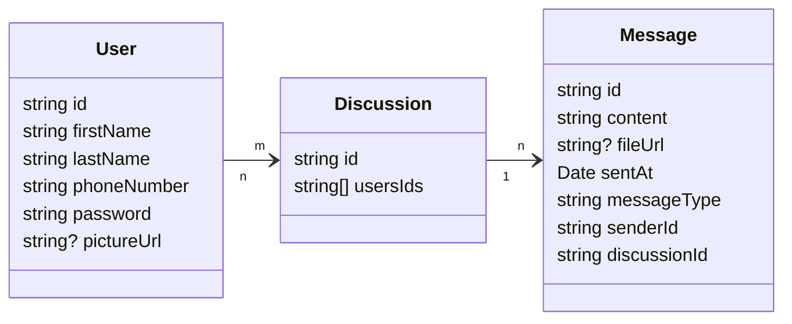

```mermaid
classDiagram
direction LR 

    class Message {
		string id
        string content
        string? fileUrl
        Date sentAt
		string messageType
        string senderId
        string discussionId
    }

    class Discussion {
		string id
		string[] usersIds
    }

    class User {
		string id
		string firstName
		string lastName
		string phoneNumber
		string password
		string? pictureUrl
    }

	User "n"  --> "m" Discussion
	Discussion "1"  --> "n" Message

```